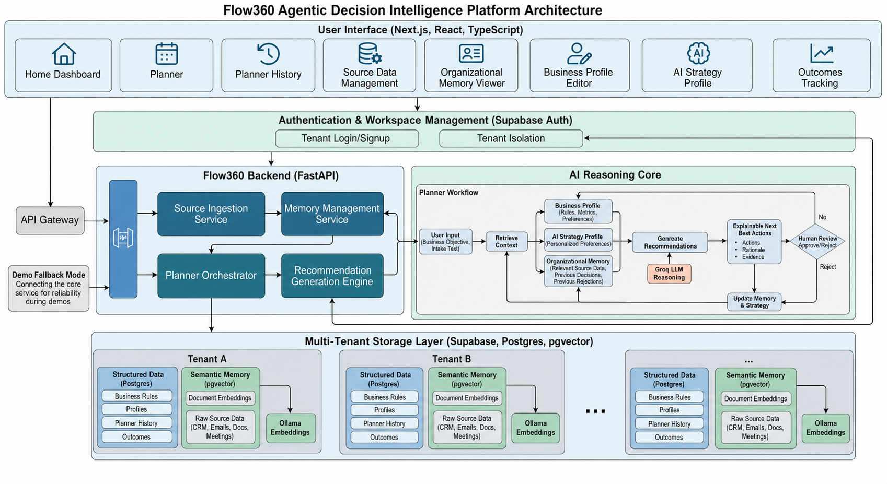

# Flow360 Architecture

## Overview

Flow360 is a multi-tenant Agentic Decision Intelligence Platform that turns company knowledge into explainable, human-reviewed Next Best Actions.

The platform is designed for business operators who need to make decisions from scattered context such as CRM notes, meeting transcripts, emails, policies, risk reports, candidate data, and previous operational decisions.

Flow360 is not a chatbot or a basic RAG application. It combines tenant-isolated organizational memory, business onboarding, planner-led reasoning, human review, and strategy learning so future recommendations become more personalized to each company.

## High-Level Architecture


## Main Layers

### 1. User Interface Layer

The frontend is built with Next.js, React, and TypeScript. It provides the main operator workspace:

- Landing page
- Authentication and workspace entry
- Home dashboard
- Planner
- Planner history
- Source data management
- Organizational memory viewer
- Business profile editor
- AI Strategy Profile
- Outcomes tracking
- Execution artifacts

The UI is designed around business workflows rather than chat. Users can add source data, create planner runs, review recommendations, approve or reject actions, and track outcomes from one workspace.

### 2. Authentication And Tenant Workspace Layer

Flow360 is designed as a multi-tenant SaaS platform. Each company has its own isolated workspace containing:

- Organizational memory
- Source data
- Planner runs
- Business profile
- AI Strategy Profile
- Recommendations
- Approvals and rejections
- Execution history
- Outcomes

Tenant isolation ensures that all retrieval, reasoning, recommendations, and memory updates are scoped to the current company workspace.

### 3. Backend Services Layer

The backend is powered by FastAPI. It exposes APIs for:

- Authentication/session handling
- Workspace management
- Business profile configuration
- Source ingestion
- Planner orchestration
- Recommendation generation
- Human review
- Memory query
- Dashboard state
- Intelligence briefs and outcomes

The backend coordinates the core business logic and keeps the frontend independent from storage, retrieval, and model-provider details.

### 4. Agentic Planner Workflow

The Planner is the intelligence engine of Flow360. A Planner Run starts when the user provides a business objective and intake context.

The workflow retrieves:

- Organizational memory
- Business Profile
- AI Strategy Profile
- Previous Planner Runs
- Relevant evidence from source data

Then the planner analyzes the business situation and generates explainable Next Best Actions.

The planner workflow is:

```text
Business Objective
        |
        v
Retrieve Organizational Memory
        |
        v
Retrieve Business Profile
        |
        v
Retrieve AI Strategy Profile
        |
        v
Retrieve Previous Planner History
        |
        v
Analyze Business Context
        |
        v
Generate Explainable Next Best Actions
        |
        v
Human Review
        |
        v
Memory Update + Strategy Learning
```

### 5. Data, Retrieval, And Memory Layer

Flow360 stores company knowledge as persistent organizational memory.

Memory types include:

- Raw memory: original source documents and interactions
- Semantic memory: embedded chunks for retrieval
- Episodic memory: planner runs, approvals, rejections, and feedback
- Profile memory: company, account, stakeholder, and business context
- Rule memory: policies, playbooks, SLA rules, approval thresholds, and procedures
- Strategy memory: learned preferences from approved and rejected recommendations

Supabase Postgres stores structured business data. pgvector enables semantic retrieval. Ollama embeddings create vectors for uploaded or entered source data.

### 6. AI Reasoning Layer

Flow360 uses Groq-backed LLM reasoning for business analysis and recommendation generation.

The LLM is not used alone. It receives structured context from retrieval, including the company's memory, business rules, previous decisions, and strategy profile.

The output is normalized into structured recommendations with:

- Action
- Category
- Priority
- Owner
- Due date
- Confidence
- Rationale
- Evidence
- Business metric
- Review status

### 7. Human Review And Execution Layer

Recommendations require human approval before they are treated as accepted actions.

Users can:

- Approve recommendations
- Reject recommendations
- Review supporting evidence
- Generate execution artifacts

Approved recommendations can produce execution drafts such as:

- Customer email
- CRM task
- Escalation note
- SLA update
- Internal summary

Both approvals and rejections become learning signals for future planner runs.

## Key Design Decisions

### Multi-Tenant By Design

Every company has isolated data, memory, planner history, recommendations, and strategy learning. This makes Flow360 suitable as a SaaS platform instead of a single demo workspace.

### Business Onboarding Before AI Reasoning

Flow360 asks companies how they operate before generating recommendations. The Business Profile captures source types, business rules, recommendation categories, and success metrics so the first planner run is already personalized.

### Planner-Led Reasoning Instead Of Chat

The system uses a structured planner workflow instead of a generic chat prompt. This makes the reasoning process easier to explain, debug, and trust.

### Persistent Organizational Memory

Flow360 stores company context over time. New source data, planner runs, reviews, and outcomes become memory for future decisions.

### Explainability And Evidence

Each recommendation includes supporting evidence, rationale, confidence, owner, due date, and business metric. This helps users understand why the system suggested an action.

### Human-In-The-Loop Control

AI recommendations are not automatically executed. Humans approve or reject actions, and those decisions update memory and strategy.

### AI Strategy Profile For Personalization

The AI Strategy Profile learns from approvals and rejections. It captures preferred recommendation patterns, trusted owners, evidence preferences, and avoid patterns.

### Demo Fallback Mode

The platform includes fallback behavior for hackathon reliability. If live services are unavailable, Flow360 can still demonstrate the workflow using local/demo data and fallback recommendations.

## Example Business Use Case

Demo objective:

> Resolve urgent staffing risk for Northstar Health Network before the ICU start date.

Demo intake:

> Northstar Health Network needs ICU nurse coverage within five days. Priya N. is shortlisted but license verification is incomplete. The account had a previous SLA breach and the CFO is concerned about premium rate approval.

Flow360 identifies the operational, compliance, SLA, and commercial risks. It retrieves relevant account memory and policies, then generates recommendations such as:

- Escalate license verification
- Prepare a backup ICU nurse shortlist
- Create a CFO premium-rate approval brief
- Send a proactive SLA-risk update

Each recommendation includes owner, due date, confidence, rationale, and evidence.

## Technology Stack

Frontend:

- Next.js
- React
- TypeScript
- Tailwind CSS
- Recharts
- lucide-react

Backend:

- FastAPI
- Pydantic
- Planner workflow services
- Supabase Python client

Data and AI:

- Supabase Postgres
- pgvector
- Ollama embeddings
- Groq LLM reasoning

## Summary

Flow360's architecture turns scattered business information into a reusable decision intelligence system. The key idea is a loop:

```text
Source Data -> Organizational Memory -> Planner Run -> Explainable Recommendations -> Human Review -> Memory + Strategy Learning
```

This loop allows each company workspace to become smarter and more personalized over time.
